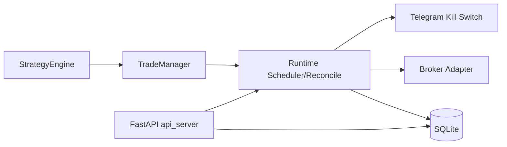
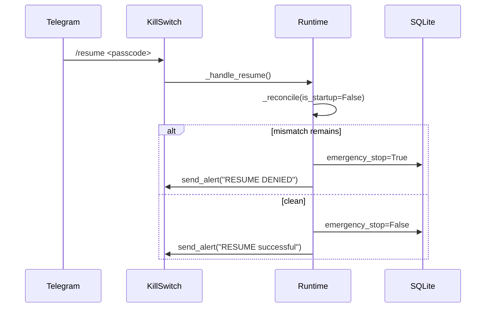

# Infinite Purchase

Rule-based semiconductor sector rotation system that runs on Kiwoom OpenAPI+.

Trades SOXL/SOXS based on SOXX regime signals. No ML, no LLM — pure Dual-Momentum logic with a finite state machine.

---

## What This Does

Watches SOXX daily close. Computes a Dual-Momentum regime score from three signals:

| Signal | Definition |
|--------|-----------|
| L | Close > SMA200 |
| M | SMA50 > SMA200 |
| A | 12-month absolute momentum > 0 |

Score = L + M + A (range 0–3). SMA20 is computed for chart display but does **not** affect scoring.

| Score | Regime | Action |
|-------|--------|--------|
| 3 | BULL | Buy SOXL (trend compounding) |
| 0 + deep drawdown | BEAR | Buy SOXS (hit-and-run) |
| 0 (shallow) / 1 / 2 | NEUTRAL | Cash, no new positions |

When flipping from BEAR → BULL, a 3-day transition swap runs: wind down SOXS, ramp up SOXL.

## Architecture

```
SOXX OHLCV
    │
    ▼
StrategyEngine        # regime FSM (L/M/A → score → state)
    │
    ▼
TradeManager          # position logic → OrderIntent[]
    │
    ▼
Runtime               # Kiwoom COM + SQLite + scheduler
    │
    ├── KiwoomAdapter     PyQt5 QAxWidget, rate-limited
    ├── SQLite            positions, orders, fills, idempotency locks
    ├── Scheduler         QTimer-based, DST-aware US market hours
    └── KillSwitch        Telegram /kill + /resume
```

## Key Modules

| File | What |
|------|------|
| `strategy_engine.py` | Dual-Momentum indicators, regime scoring (L+M+A), FSM transitions |
| `trade_manager.py` | Slice-based buying, trailing stops, take-profit, vampire rebalance, cooldown |
| `runtime.py` | 24/7 orchestrator — scheduling, reconcile, fill processing |
| `kiwoom_adapter.py` | Kiwoom OpenAPI+ COM wrapper with backoff + token bucket |
| `db.py` | SQLite schema + CRUD + idempotent daily action locks |
| `kill_switch.py` | Telegram polling — emergency stop / resume |
| `config.py` | All tunables in one place (including `KiwoomTrConfig` for overseas TR IDs) |

## Strategy Details

### SOXL Engine (Bull)
- Daily accumulation via configurable slice count (default 35 slices)
- Averaging down: 1 slice normally, 2 at -8%, 3 at -15% from avg cost
- Trailing stop: sell 50% at -15% from peak, sell all at -25%
  - **Peak** is defined as max(price) since position entry (or last full closure). Adding slices does not reset the peak.

### SOXS Engine (Bear)
- Allocation capped at 30% of total capital
- Take-profit at +8%, max holding 25 days
- Loss cuts at -15% (half) and -25% (all)
- **Cooldown**: after a max-holding forced close, new SOXS buys are blocked for 3 days (configurable via `soxs_cooldown_days`), even if BEAR state persists. Cooldown state is persisted in SQLite and survives restarts.

### Vampire Rebalance
When SOXL drawdown exceeds the injection threshold during BEAR regime and a SOXS position closes at profit:
- Drawdown ≤ -50%: inject **50%** of realized gain into next SOXL buy
- Drawdown ≤ -40%: inject **70%** of realized gain

Injection is capped by remaining SOXL slice capacity. Budget persists across runtime cycles via SQLite.

### Transition Swap (BEAR → BULL)
- Day 1: Stop SOXS buys, start SOXL (1 slice)
- Day 2: Sell 50% SOXS, SOXL buys + profit injection
- Day 3: Sell all SOXS, resume normal bull engine

## Safety

- **Idempotent buys** — SQLite `INSERT OR IGNORE` lock per (date, symbol). No double buys even on crash/restart.
- **Reconcile** — broker holdings vs. DB on every startup + every 15 min. Mismatch → emergency stop + cancel all + Telegram alert.
- **Orphan cleanup** — unfilled orders cancelled at EOD+5min, locks rolled back.
- **Rate limiting** — token bucket (1 req/s) + exponential backoff up to 30s cap.
- **Kill switch** — Telegram `/kill` persists to SQLite, survives restarts.
- **TR validation** — Kiwoom TR IDs are centralised in `KiwoomTrConfig`. On startup, placeholder TR IDs are detected and trading is disabled (emergency stop) with a clear log message until real TR codes are plugged in.

## Setup

```
pip install pyqt5 pandas requests
```

Requires Kiwoom OpenAPI+ installed (Windows only).

```
set KIWOOM_ACCOUNT=your_account_number
set TELEGRAM_TOKEN=your_bot_token
set TELEGRAM_CHAT_ID=your_chat_id

python runtime.py
```

## Tests

```
pytest test_strategy_engine.py test_trade_manager.py test_integration.py -v
```

91 tests covering:
- Dual-Momentum indicator computation (L, M, A), score logic
- FSM transitions (all regime paths including 3-day swap)
- Trailing stops (peak persistence, stage one-shot, full exit reset)
- Take-profit, loss cuts, averaging down, slice capping
- SOXS cooldown (forced close → blocked rebuy → expiry → allowed)
- Vampire rebalance (dynamic ratio at -40%/-50%, injection cap, budget persistence)
- Fill application + position resets
- Sell deduplication, determinism, immutability
- Integration: kill switch idempotency, reconcile mismatch, cooldown with DB persistence
- KiwoomTrConfig placeholder validation

## Notes

- All Kiwoom-specific TR codes are centralised in `KiwoomTrConfig` with placeholder values. Replace them with the correct 해외주식 TR IDs for your account type before going live.
- `runtime.py` is a working skeleton. The strategy + trade logic is fully implemented and tested.
- No margin. Cash only. One buy per symbol per day.

## License

MIT — not financial or legal advice.

## Runtime Rules Clarifications

### Regime Scoring Formula
- `L = 1` when `close > SMA200`, else `0`
- `M = 1` when `SMA50 > SMA200`, else `0`
- `A = 1` when `12M momentum > 0`, else `0`
- `score = L + M + A` (0..3)

### SOXS Cooldown Rule
After a `MAX_HOLDING_EXIT` on SOXS, runtime sets `soxs_cooldown_remaining=soxs_cooldown_days`.
While cooldown is positive, SOXS buy intents are suppressed.

### Carry Budget Reset Rule
`injection_budget` is bounded by remaining SOXL slice capacity:

`max_inject = (soxl_max_slices - soxl_slices_used) * soxl_slice_notional`

On each realized SOXS profit event, the budget update is capped so it cannot grow unbounded.

## Selected Configuration Parameters
- `RuntimeConfig.reconcile_interval_min`: periodic reconcile cadence.
- `RuntimeConfig.kill_resume_passcode`: Telegram resume passcode.
- `TradeManagerConfig.soxs_cooldown_days`: SOXS post-forced-close buy cooldown.
- `TradeManagerConfig.soxl_slice_notional`: cap reference for persisted injection budget.

## Deployment (FastAPI + Uvicorn + systemd)
1. Install dependencies: `pip install fastapi uvicorn[standard]`
2. Run API server: `uvicorn api_server:app --host 0.0.0.0 --port 8000`
3. Example systemd service:

```ini
[Unit]
Description=Alpha Predator API
After=network.target

[Service]
WorkingDirectory=/opt/alpha-predator
ExecStart=/usr/bin/uvicorn api_server:app --host 0.0.0.0 --port 8000
Restart=always
User=trader
Environment=PYTHONUNBUFFERED=1

[Install]
WantedBy=multi-user.target
```

## Architecture Diagram



## Sequence Chart (Resume/Reconcile Safety)



## Risk & Operational Notes
- Never clear emergency stop without a successful reconcile.
- Treat balance fetch failure as a critical fault: stop buys and raise alert.
- Avoid logging secrets (Telegram passcodes, raw sensitive payloads).
- Keep SOXS exits single-intent per cycle to prevent duplicate sells.
