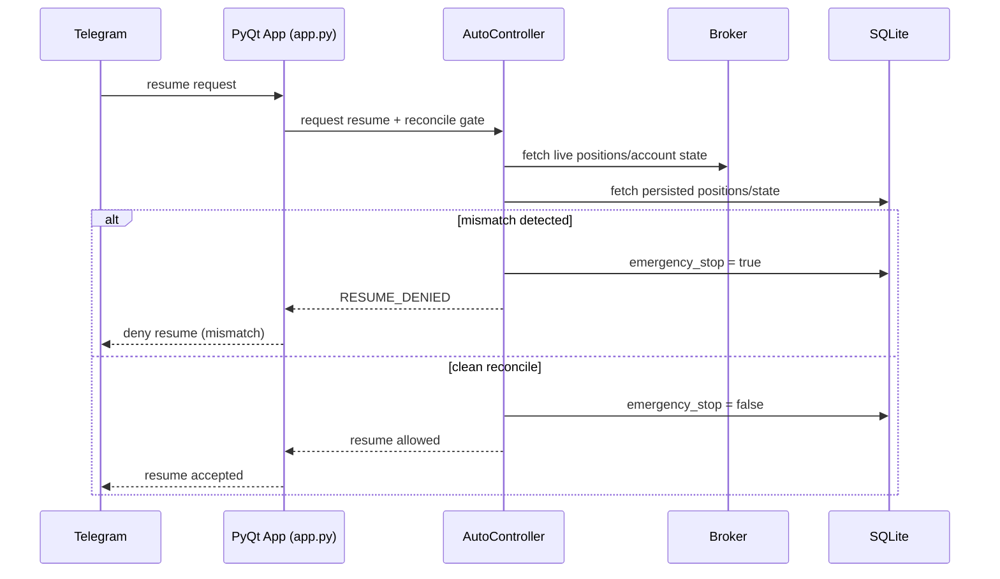

# Infinite Purchase — Kiwoom REST Trading UI

PyQt desktop trading application for semiconductor regime trading, centered on `app.py`.

Trades SOXL/SOXS using SOXX regime signals. No ML/LLM decisioning in the execution path.

Legacy files from older architecture may remain in repository history, but product behavior is UI-first via `app.py` only.

## What This Does

The strategy watches SOXX daily close and computes a Dual-Momentum regime score from three signals:

| Signal | Definition |
|--------|-----------|
| L | Close > SMA200 |
| M | SMA50 > SMA200 |
| A | 12-month absolute momentum > 0 |

Score = L + M + A (range 0–3). SMA20 is calculated for charting and context, not for regime scoring.

| Score | Regime | Action |
|-------|--------|--------|
| 3 | BULL | Buy SOXL (trend compounding) |
| 0 + deep drawdown | BEAR | Buy SOXS (hit-and-run) |
| 0 (shallow) / 1 / 2 | NEUTRAL | Cash, no new positions |

When flipping from BEAR → BULL, a 3-day transition swap runs: wind down SOXS, ramp up SOXL.

## Architecture

The production runtime is **app-first**:

- **Entry point:** `python app.py`
- **UI shell:** `MainWindow` + `LoginPage` + `TradingScreen`
- **Login flow:** `LoginPage` collects App Key / App Secret / Account Number and Telegram settings, then calls `MainWindow.begin_live(...)` or `MainWindow.begin_guest()`.
- **Mode execution model:**
  - **Guest:** chart/indicator UI only, no trading execution
  - **Paper:** `PaperBroker` simulation for orders/fills/account
  - **Live:** `KiwoomRestBroker` for authenticated account/order flow
- **Auto stack:** `AutoTradingController` uses `StrategyEngine` + `TradeManager` outputs to place broker orders under emergency-stop gates.
- **Conditions:** `ConditionEngine` stores and executes condition orders with emergency-stop awareness.
- **Persistence:** SQLite initialized at startup (`init_db` + `run_migrations`).


## Key Modules

| File | What |
|------|------|
| `app.py` | Main PyQt entrypoint; login + mode bootstrap (`begin_live` / `begin_guest`) |
| `pages/trading_screen.py` | Main trading UI, broker routing, auto toggle, reconcile live gate |
| `auto/auto_trading_controller.py` | Periodic auto execution orchestration |
| `strategy_engine.py` | Dual-Momentum indicators, regime scoring (L+M+A), FSM transitions |
| `trade_manager.py` | Position/order intent logic (slices, exits, cooldown, rebalance) |
| `conditions/condition_engine.py` | Condition-order persistence and trigger execution |
| `broker/paper_broker.py` | Local paper account/order/fill broker |
| `broker/kiwoom_rest_broker.py` | Kiwoom REST broker implementation |
| `db_migrations.py` | Startup schema migrations for app-specific tables |
| `telegram_manager.py` | Telegram validation + notification sending |

## Strategy Details

### SOXL Engine (Bull)
- Daily accumulation via configurable slice count (default 35 slices)
- Averaging down: 1 slice normally, 2 at -8%, 3 at -15% from avg cost
- Trailing stop: sell 50% at -15% from peak, sell all at -25%
  - **Peak** is defined as max(price) since position entry (or last full closure). Adding slices does not reset the peak.

### SOXS Engine (Bear)
- Allocation capped at 30% of total capital
- Take-profit at +8%, max holding 25 days
- Loss cuts at -15% (half) and -25% (all)
- **Cooldown**: after a max-holding forced close, new SOXS buys are blocked for 3 days (configurable via `soxs_cooldown_days`), even if BEAR state persists. Cooldown state is persisted in SQLite and survives restarts.

### Vampire Rebalance
When SOXL drawdown exceeds the injection threshold during BEAR regime and a SOXS position closes at profit:
- Drawdown ≤ -50%: inject **50%** of realized gain into next SOXL buy
- Drawdown ≤ -40%: inject **70%** of realized gain

Injection is capped by remaining SOXL slice capacity. Budget persists across runtime cycles via SQLite.

### Transition Swap (BEAR → BULL)
- Day 1: Stop SOXS buys, start SOXL (1 slice)
- Day 2: Sell 50% SOXS, SOXL buys + profit injection
- Day 3: Sell all SOXS, resume normal bull engine

## Safety

- **Idempotent actions** via DB lock keys for buy-path actions.
- **Emergency-stop gating**: auto execution and manual live flow are blocked when emergency stop is active.
- **Reconcile-first live safety**: live mode performs broker-vs-DB position checks; mismatch triggers fail-safe.
- **Fail-safe behavior**: reconcile mismatch keeps emergency stop active and sends alert path when configured.
- **Secret hygiene**: credentials are entered in UI and should never be logged.

### Sequence Chart (Resume/Reconcile Safety)



## Setup

```bash
pip install -r requirements.txt
python app.py
```

### Runtime startup behavior

- `app.py` opens SQLite and runs DB migrations at startup (`init_db` + `run_migrations`).
- Migration-managed tables include:
  - `paper_orders`
  - `paper_fills`
  - `live_orders`
  - `indicator_settings`
  - `ui_settings`
  - `condition_orders`
  - `telegram_settings_meta`

### Credentials and secrets

- Kiwoom App Key / App Secret / Account Number are entered in the **login UI**.
- Telegram token/chat settings are entered in the same login flow when notifications are enabled.
- Do **not** hardcode secrets in source.
- Do **not** print/log raw secrets or tokens.
- Do **not** persist plaintext secrets in SQLite.

### Environment variables

- Endpoint/base URL and non-secret runtime configuration may still be supplied via environment variables where applicable.
- Treat secrets as interactive UI inputs unless your deployment policy enforces a secure secret store.

## Tests

```bash
pytest -v
```

## Notes

- `runtime.py` and legacy COM-era modules may still exist for historical compatibility/testing, but primary end-user operation is app-first via `app.py`.
- Guest mode is non-trading.
- Paper mode uses `PaperBroker` simulation.
- Live mode uses `KiwoomRestBroker`.


## Windows EXE 빌드 (PyInstaller)

데스크탑 앱(`app.py`)을 단일 배포 가능한 EXE 형태로 빌드할 수 있습니다.

### 1) 빠른 빌드 (Windows)

```bat
build_exe.bat
```

성공 시 산출물:

```text
dist\AlphaPredator\AlphaPredator.exe
```

### 2) 수동 빌드

```bat
py -m pip install pyinstaller pyqt5 pandas numpy
py build_exe.py
```


